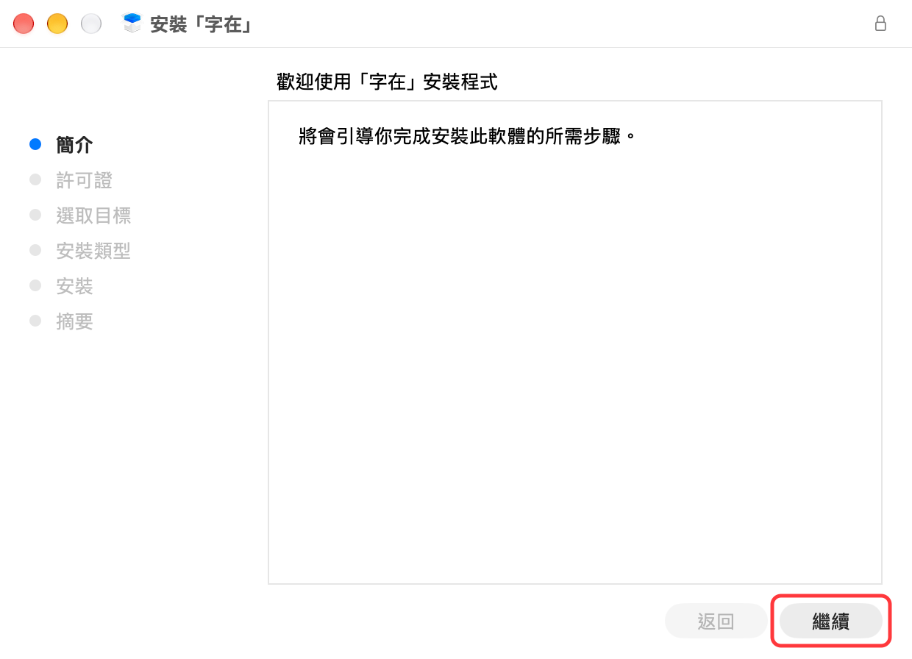
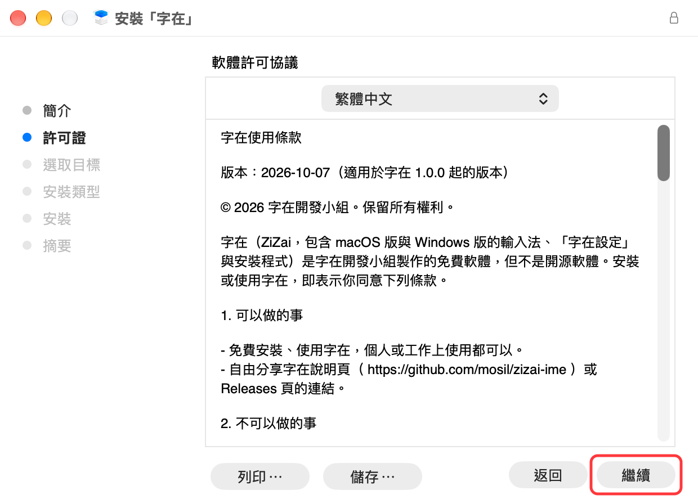
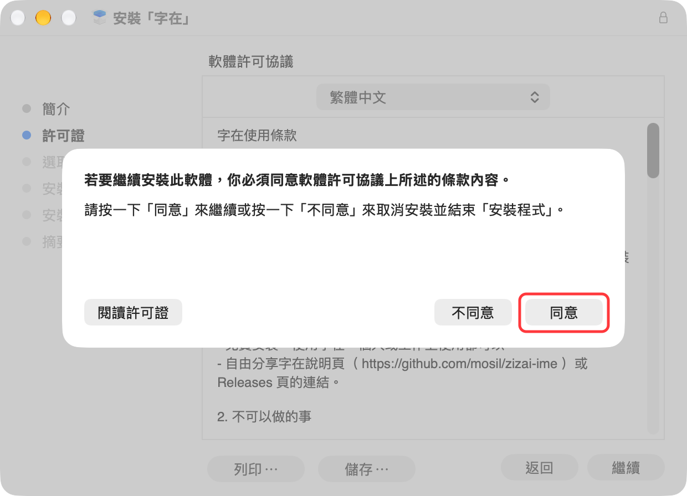
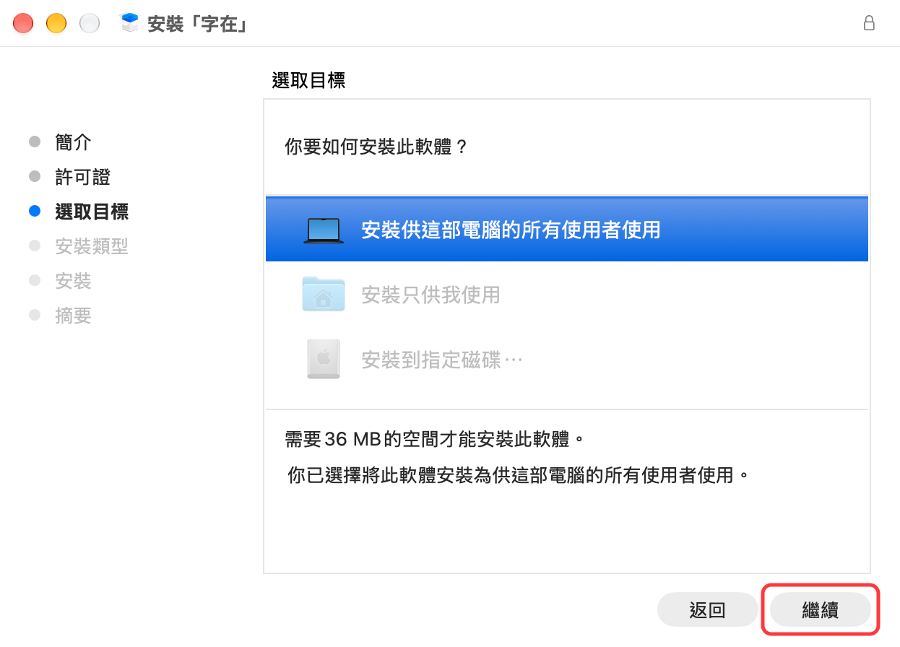
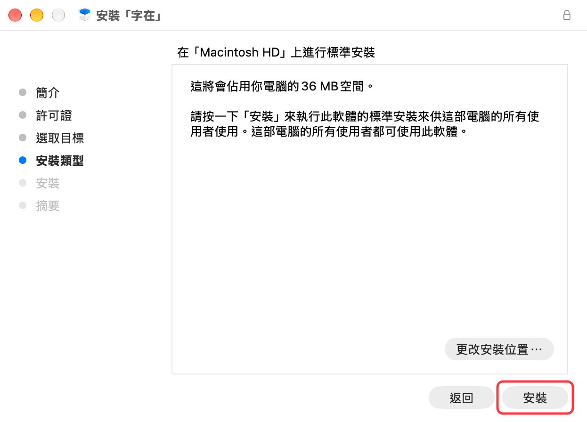
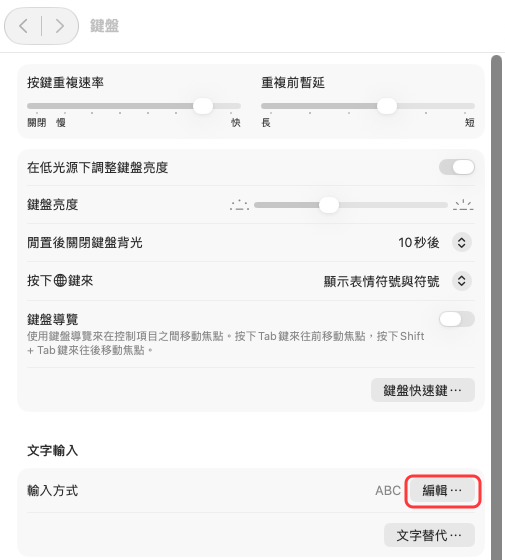
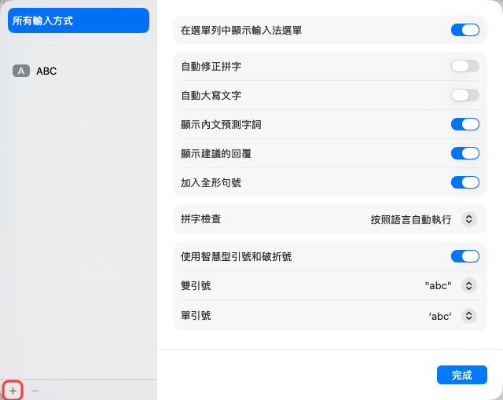
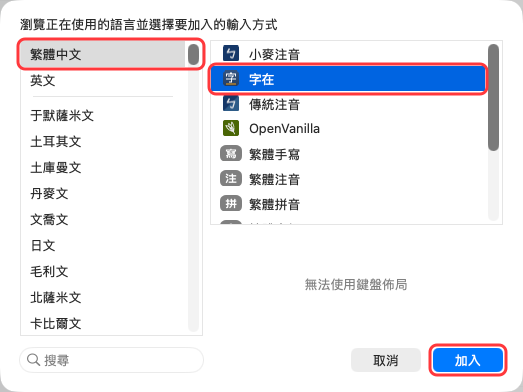
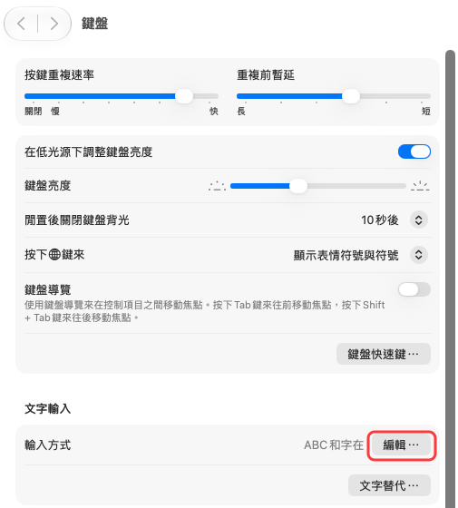
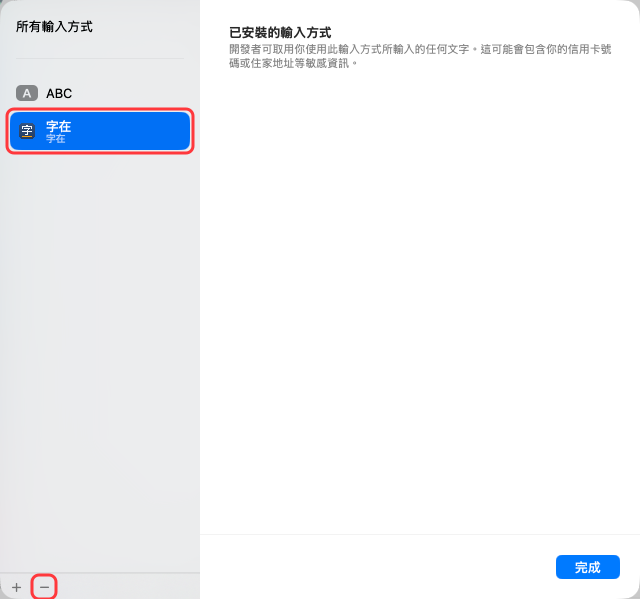

# 安裝與使用

這一頁是 macOS 版。Windows 版的安裝、切換與解除安裝見 [安裝與使用（Windows）](安裝與使用（Windows）.md)；打字、選字、字根表、補字這些兩個版本相同的部分寫在這一頁。

## 系統需求

macOS 13 以上。

## 安裝

1. 從 [下載頁](../README.md#下載) 下載壓縮檔，解壓縮後按兩下安裝檔 `ZiZai.pkg` 。Safari 預設會自動解壓縮，下載項目裡直接就是 `ZiZai.pkg` 。
2. 在安裝程式的第一頁按「繼續」。

   

3. 閱讀「軟體許可協議」（字在的使用條款與隱私權政策的重點），按「繼續」：

   

   在跳出的視窗按「同意」。不同意的話按「不同意」，不會安裝：

   

4. 「選取目標」選「安裝供這部電腦的所有使用者使用」，按「繼續」。

   

5. 按「安裝」，輸入電腦的管理者密碼。安裝完成後按「關閉」。

   

6. 「系統設定」如果開著，先按 Command＋Q 結束它，因為它不會重新讀取輸入法清單。
7. 打開「系統設定」→「鍵盤」，按「文字輸入」的「輸入方式」右邊的「編輯⋯」。

   

8. 按左下角的「＋」。

   

9. 在左邊選「繁體中文」，在右邊選「字在」，按「加入」。右邊清單裡的其他輸入法，依每台電腦而不同。

   

清單裡找不到「字在」，或只看到一列空白時，請登出再登入一次。只重開「系統設定」不夠。

安裝時會一起裝好「字在設定」，放在「應用程式」資料夾。

## 切換輸入法

- 按 Control＋Space，在「ABC」和「字在」之間切換（macOS 預設的「選擇上一個輸入方式」）。
- 如果你在系統的輸入方式設定裡開啟了「用 Caps Lock 切換 ABC」的選項，按 Caps Lock 也能切換。
- 也可以從選單列的輸入法圖示選「字在」。

## 打字與選字

- 按字根鍵組字，組字區會顯示字根。
- 空白鍵送出第 1 個候選字。
- 選字鍵依序是 空白、`'`、`[`、`]`、`-`、`\`、`6`、`7`、`8`、`9`、`0`。
- 候選字不只一頁時，用方向鍵（← ↑ 上一頁、→ ↓ 下一頁）或 Page Up／Page Down 翻頁。
- 按 Esc 取消組字。
- 候選窗開著時直接打下一個字，會先送出第 1 個候選字。

## 三碼與四碼

四碼字會自動推導出三碼（推導，非官方），打三碼或四碼都可以。從選單列的輸入法選單可以切換：

- **以四碼為主**（預設）：四碼的候選字順序固定不變。
- **以三碼為主**：三碼的候選字依常用程度排，常打三碼的人首選比較準；代價是少數字打四碼時順序會變。
- **推導二碼**：三碼、四碼的字也能用首尾兩碼打（預設開啟）。

## 標點與符號

按 `=` 再按一顆鍵，打出中文標點、全形符號、注音符號、羅馬數字等。完整的按法見 [符號字根表](符號字根表.md)。

想加自己的符號，或停用不需要的內建符號，到「字在設定」的「符號」分頁。

## 字根表

字在用兩種字根表打字：

- **內建自建字根表**：「字在自建字根表（依規則自建，非官方）」，裝好就能用。內建字根表的碼由程式依字在的取碼規則、全字庫的部件與筆順資料，以及人工指定與調整的字根清單產生。本表不是任何輸入法廠商的官方字根表；字在與任何輸入法廠商無關，未經其授權或背書。
- **擴充字根表**：在「字在設定」的「擴充字根表」分頁匯入 `.cin` 格式的字根表（OpenVanilla、PIME、hime 等輸入法使用的碼表格式），或自己建立一份。擴充字根表疊在內建表上，同一個輸入碼時排在前面。

內建字根表的輸入碼，是依全字庫的部件與筆順重新產生的，所以有些字的拆法可能和你習慣的不同。需要的話，可以在「字在設定」的「擴充字根表」分頁，替這些字加上你習慣的輸入碼。

請使用你有權使用的 `.cin` 檔，匯入的字根表只供你自己使用。字在不附、也不提供下載任何第三方的字根表檔案。

## 補字與自訂輸入碼

在「字在設定」裡：

- **我的詞庫**：補上缺的字、替字加上自己的輸入碼、停用用不到的字。
- **查碼**：查一個字在字根表裡的輸入碼，也可以直接拿來補字或改碼。

改完會自動套用，不必重新啟動輸入法。

## 擴充區的字

內建字根表收錄 Unicode 擴充區的字，其中大多數要另外安裝字型才顯示得出來。輸入法選單的「隱藏字型顯示不出來的字」預設開啟，這些字不會出現在候選窗，也就不會看到空白或方框。

想打這些字，可以安裝全字庫的字型：

1. 到政府資料開放平臺的全字庫資料集（ https://data.gov.tw/dataset/5961 ），下載 `Fonts_Sung.zip` （全字庫宋體；候選窗的擴充區字就是用它顯示）。想要楷體，可以另外下載 `Fonts_Kai.zip` 。
2. 解壓縮後選取所有字型檔，按兩下用「字體簿」安裝。
3. 登出再登入，字在才會重新檢查哪些字顯示得出來。之後這些字就會出現在候選窗，**不用**關掉「隱藏字型顯示不出來的字」。

輸入法選單的「隱藏系統字型沒有的字（即使另外裝了字型）」預設關閉。打開後，只有另外安裝的字型才顯示得出來的字也不列入候選，適合打的文件要給沒裝字型的人看的時候。

全字庫字型由全字庫網站提供，依政府資料開放授權條款或 SIL Open Font License 1.1 授權；字在不附字型檔。

## 解除安裝

1. 打開「系統設定」→「鍵盤」，按「輸入方式」右邊的「編輯⋯」。

   

   選「字在」，按左下角的「−」移除。

   

2. 刪除下列項目（在 Finder 選「前往」→「前往檔案夾⋯」，輸入路徑就能找到；刪除時需要管理者密碼）：
   - `/Library/Input Methods/Zizai.app`
   - 「應用程式」資料夾裡的「字在設定」
   - `~/Library/Application Support/Zizai` （你的詞庫與擴充字根表都在這裡；要保留就不要刪）
3. 要清除輸入法選單裡的選項（例如以四碼或三碼為主），在「終端機」執行 `defaults delete studio.mosil.inputmethod.zizai` 。
4. 登出再登入。

本頁截圖裡的 macOS 介面屬於 Apple，用來說明安裝與使用的步驟；紅框與裁切是字在開發小組加的。
