# 安裝與使用（Windows）

這一頁是 Windows 版的安裝、切換與解除安裝。打字、選字、字根表、補字這些兩個版本相同的部分，見 [安裝與使用](安裝與使用.md)（macOS 版）。

**請先看這段**：Windows 版 1.0.0 的安裝程式與輸入法沒有數位簽章。Windows 會跳出安全警告；「智慧型應用程式控制」開著的電腦，或公司、學校管理的電腦，可能裝不起來，或裝好了也載入不了字在（見「目前的限制」）。安裝前請先核對檔案的 SHA-256（見「安裝」的第 2 步）。

## 系統需求

- Windows 10 或 11，64 位元或 32 位元，下載的檔案不同：
  - **64 位元的 Windows**（大多數電腦）：`ZiZai-Win-x64-<版本>.zip` 。32 位元的 App 也能用字在。
  - **32 位元的 Windows 10**：`ZiZai-Win-x86-<版本>.zip` 。
  - 不知道是哪一種：「設定」→「系統」→「系統資訊」（Windows 10 是「關於」），看「系統類型」是「64 位元作業系統」還是「32 位元作業系統」。
- 「字在設定」要用 Microsoft Edge WebView2 。Windows 11 內建；電腦沒有時，安裝程式會連網下載安裝。
- 實際測過的是 Windows 11 Pro（組建 26300，64 位元）與在上面執行的 32 位元 App，以及全新安裝的 Windows 10 專業版 22H2（64 位元與 32 位元）。更早的 Windows 10 沒有實測；能安裝不代表確定相容。
- ARM64 的電腦還不支援，見「目前的限制」。

## 安裝

1. 從 [下載頁](../README.md#下載) 下載符合電腦的檔案（見「系統需求」）： `ZiZai-Win-x64-<版本>.zip` 或 `ZiZai-Win-x86-<版本>.zip` 。請只從 GitHub 上 `mosil/zizai-ime` 的 [Releases](https://github.com/mosil/zizai-ime/releases) 下載。
2. 核對 SHA-256：在下載的資料夾空白處按右鍵，選「在終端機中開啟」（Windows 10 沒有這一項：按住 Shift 再按右鍵，選「在這裡開啟 PowerShell 視窗」），執行下面這行（ `<檔名>` 換成下載的檔名），把顯示的 Hash 和 Releases 頁面上列出的比對：

   ```powershell
   Get-FileHash .\<檔名> -Algorithm SHA256
   ```

   不相同就不要安裝，刪掉檔案重新下載。只看檔名不能確認檔案內容。
3. 在下載的檔案上按右鍵，選「解壓縮全部」（Windows 11 的右鍵選單裡沒有的話，先按「顯示其他選項」；Windows 10 的右鍵選單直接就有）：

   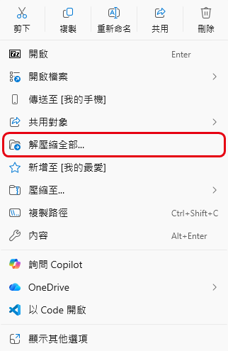

4. 按「解壓縮」。解壓縮完會打開新的資料夾，裡面是 `ZiZai.exe` ：

   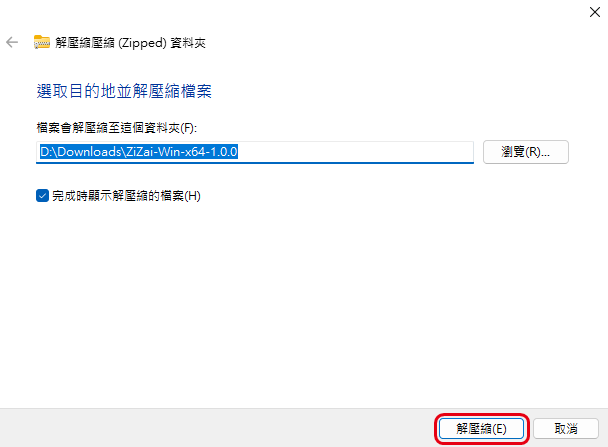

5. 按兩下 `ZiZai.exe` 。Windows 可能跳出「Windows 已保護您的電腦」：這表示 Windows 還不能用數位簽章確認發行者，不代表檔案一定安全，也不代表一定有害。確認檔案是從上面的 Releases 下載、SHA-256 也相符，決定要安裝的話，按「其他資訊」：

   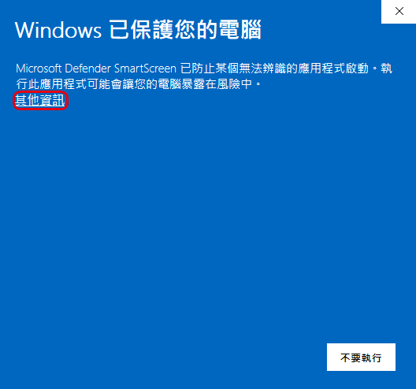

6. 畫面上的「應用程式」應該是 `ZiZai.exe` ，按「仍要執行」。不確定來源、雜湊值不符、畫面出現其他威脅警告，或沒有「仍要執行」時，請停止安裝：

   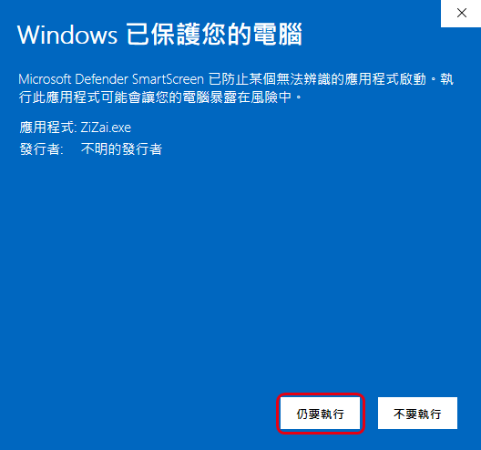

7. 「使用者帳戶控制」問是否允許變更時，按「是」。畫面和這裡寫的不同時，請停止。
8. 在歡迎頁按「下一步」：

   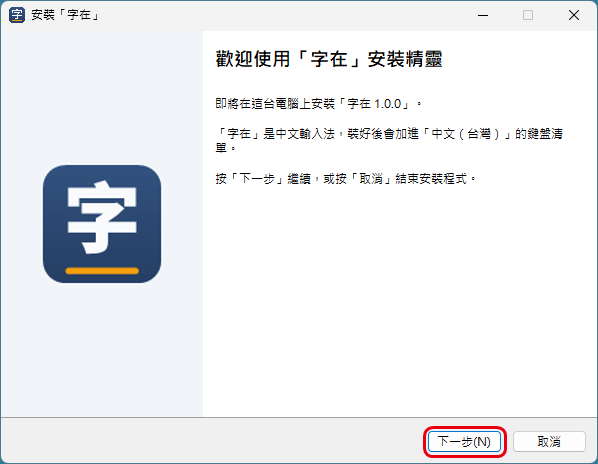

9. 閱讀「使用條款」，選「我同意」再按「下一步」，安裝程式就開始安裝。不同意的話按「取消」，不會安裝：

   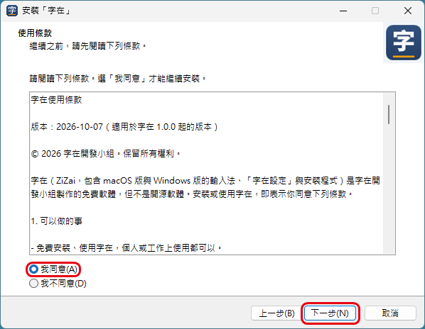

10. 看到「『字在』安裝完成」，按「完成」：

   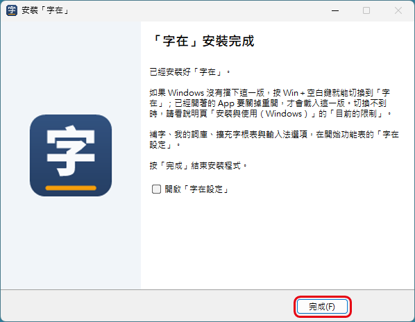

11. 安裝程式會把「字在」加進「繁體中文 (台灣)」的鍵盤清單。可以到「設定」→「時間與語言」→「語言與地區」，按「繁體中文 (台灣)」右邊的「⋯」→「語言選項」，在「鍵盤」看到「字在」（Windows 10 是「設定」→「時間與語言」→「語言」，點「繁體中文 (台灣)」再按「選項」）：

   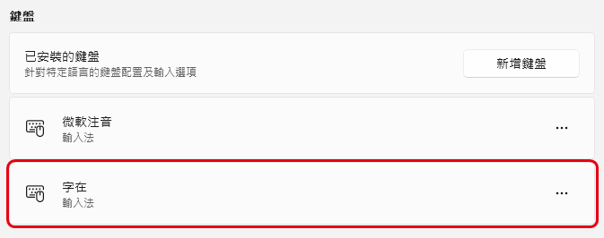

   清單裡沒有「字在」時，按「已安裝的鍵盤」右邊的「新增鍵盤」（Windows 10 是「鍵盤」下面的「新增鍵盤」），選「字在」。

安裝程式會一起裝好「字在設定」，放在開始功能表。檔案裝在 `C:\Program Files\Zizai` ；詞庫、擴充字根表與設定放在 `%APPDATA%\Zizai` 。

已經開著的 App 要關掉重開，才會用到剛裝好的字在。升級到新版時也一樣：直接執行新版的安裝程式，不必先解除安裝。如果「字在設定」開著，安裝程式會先列出它，選「自動關閉這些應用程式」再按「下一步」。

## 切換輸入法

- 按 Win＋空白鍵，在跳出來的清單選「字在」：

   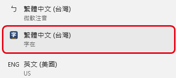

- 切到「字在」後，工作列右下角會顯示「中」；按一下變成「英」，這時按鍵直接打出英文，再按一下切回「中」：

    

## 打字與選字

打字、選字、三碼（推導，非官方）與四碼、標點與符號的按法，和 macOS 版相同，見 [安裝與使用](安裝與使用.md) 的「打字與選字」以後各節。macOS 版寫「輸入法選單」的選項，Windows 版在「字在設定」的「輸入法選項」分頁。

內建的是「字在自建字根表（依規則自建，非官方）」：碼由程式依字在的取碼規則、全字庫的部件與筆順資料，以及人工指定與調整的字根清單產生。本表不是任何輸入法廠商的官方字根表；字在與任何輸入法廠商無關，未經其授權或背書。

## 字在設定

1. 按「開始」，搜尋「字在設定」，打開它：

   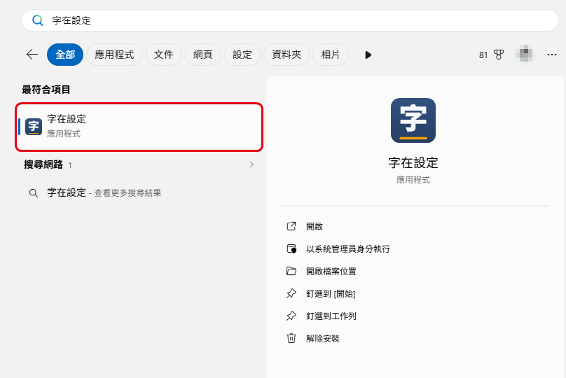

2. 「我的詞庫」「擴充字根表」「符號」「查碼」各分頁的用法，和 macOS 版相同。
3. 「輸入法選項」分頁放的是 macOS 版在輸入法選單裡的選項，改了就自動儲存，切回其他 App 打字時生效：

   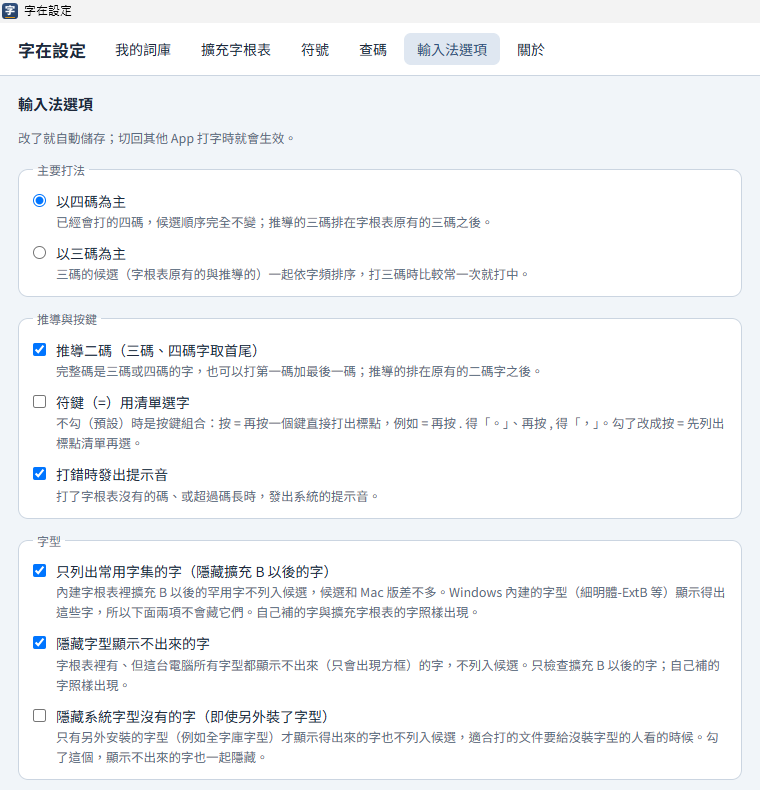

   - **以四碼為主**（預設）／**以三碼為主**：主要打法，和 macOS 版相同；三碼包含推導的三碼（推導，非官方）。
   - **推導二碼**（預設開啟）：三碼、四碼的字也能用首尾兩碼打。
   - **符鍵（=）用清單選字**（預設關閉）：關閉時用按鍵組合，打開時先列出標點清單再選。
   - **打錯時發出提示音**（預設開啟）。
   - **只列出常用字集的字**（預設開啟）：擴充 B 以後的罕用字不列入候選。實際的候選也受下面兩個字型選項影響。
   - **隱藏字型顯示不出來的字**（預設開啟）、**隱藏系統字型沒有的字**（預設關閉）：見下一節。

## 擴充區的字

內建字根表收錄 Unicode 擴充區的字。「輸入法選項」分頁的「只列出常用字集的字」預設開啟，這時擴充 B 以後的罕用字不會出現在候選窗；自己補的字和擴充字根表的字照樣出現。想打這些字，請取消勾選這一項。

取消之後，Windows 內建字型（細明體-ExtB 等）顯示得出來的字就會出現在候選窗；這台電腦所有字型都顯示不出來的字，「隱藏字型顯示不出來的字」（預設開啟）會把它們藏起來。想打這些字，可以安裝全字庫的字型：

1. 到政府資料開放平臺的全字庫資料集（ https://data.gov.tw/dataset/5961 ），下載 `Fonts_Sung.zip` （全字庫宋體）。想要楷體，可以另外下載 `Fonts_Kai.zip` 。
2. 解壓縮後選取所有字型檔，按右鍵選「安裝」。
3. 重新開啟要打字的 App，字在才會重新檢查哪些字顯示得出來。

「隱藏系統字型沒有的字（即使另外裝了字型）」預設關閉。打開後，只有另外安裝的字型才顯示得出來的字也不列入候選，可以減少要另外裝字型才看得到的字；對方看不看得到，仍取決於對方的電腦與字型。

全字庫字型由全字庫網站提供，依政府資料開放授權條款或 SIL Open Font License 1.1 授權；字在不附字型檔。

## 解除安裝

1. 打開「設定」→「應用程式」→「已安裝的應用程式」，搜尋「字在」，按右邊的「⋯」→「解除安裝」，再按一次「解除安裝」確認（Windows 10 是「設定」→「應用程式」→「應用程式與功能」，搜尋「字在」後點它，按「解除安裝」，再按一次「解除安裝」確認）：

   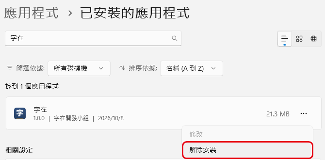

2. 「使用者帳戶控制」按「是」。問「確定要移除『字在』嗎？」時按「是」（只會移除程式，詞庫、擴充字根表、設定與記錄檔會留著）：

   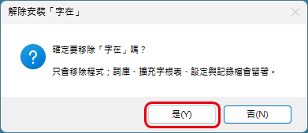

3. 看到「『字在』解除安裝完成」，按「確定」。訊息裡的「有些項目無法移除」，指的是還開著的 App 正在使用的檔案，重新開機時會自動刪除，不用自己動手。沒有 App 在用字在時，訊息是「已經從這台電腦移除『字在』」：

   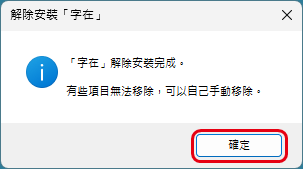

解除安裝會從鍵盤清單移除「字在」、刪掉 `C:\Program Files\Zizai` 和開始功能表的「字在設定」。還開著、用過字在的 App 正在使用的檔案，會在重新開機時刪除。

解除安裝只移除程式。詞庫、擴充字根表與設定（ `%APPDATA%\Zizai` ），以及記錄檔（ `%LOCALAPPDATA%\Zizai` 裡的 `tsf.log` 與 `tsf.log.1` ）會留著，重新安裝後詞庫還能用。不要了的話，先關掉用過字在的 App，再刪掉這兩個資料夾；詳見 [隱私權政策](../PRIVACY.md)。

## 目前的限制

- 還沒有 ARM64 版。ARM64 的電腦可以安裝 x64 版，但原生 ARM64 的 App 載入不到字在。
- 64 位元的 Windows 裝了 x86 版的話，安裝程式會擋下來，請改用 x64 版（不然 64 位元的 App 用不了字在）。
- 安裝程式和輸入法都還沒有數位簽章：
  - 下載的安裝程式會被 SmartScreen 警告（見「安裝」的第 5、6 步）。
  - 「Windows 安全性」的「智慧型應用程式控制」開啟時，可能擋下未簽章的輸入法，字在就載入不了（還沒實測）。狀態在「Windows 安全性」→「應用程式與瀏覽器控制」→「智慧型應用程式控制設定」。字在不會、也不建議你為了它關掉這項保護。
  - 公司、學校管理的電腦，可能依管理政策擋下安裝程式或輸入法，請洽系統管理員。
- 在測過的電腦上，每個載入字在的 App 約多用 50 MB 記憶體，實際用量依情況不同。
- 候選窗沒有深色模式，也不能用滑鼠點選。
- 只接受 UILess 輸入法的程式（例如部分全螢幕遊戲）用不了字在。
- 換了 Windows 的深色、淺色模式後，工作列的「中」「英」要切換一次輸入法才會換顏色。

遇到問題，請到 GitHub 的 [Issues](https://github.com/mosil/zizai-ime/issues) 回報。Issues 是公開的：不要直接貼記錄檔的原文，也不要上傳 `user.db` 、`user.pack` 或含有個人資料的截圖；需要記錄時，我們會說明只要哪幾行。

本頁截圖裡的 Windows 介面屬於 Microsoft，用來說明安裝與使用的步驟；紅框與裁切是字在開發小組加的。
